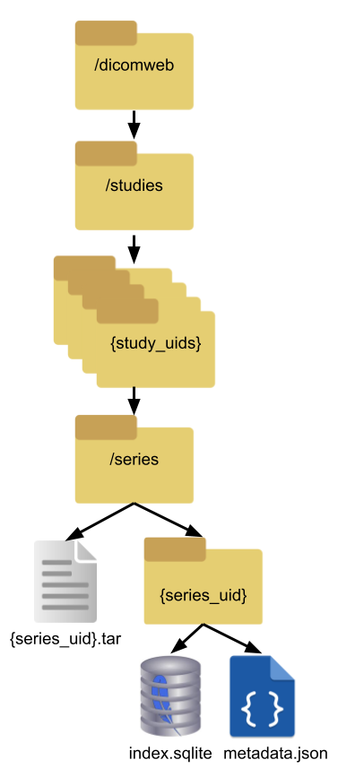

# Summary

The Cloud Optimized Dicom package (or COD) provides a framework for storing, manipulating,
and retrieving DICOM files in the cloud in a cost-optimal way.

It is designed to be a cheaper, more intuitive substitute for current DICOM file storage methods common in the healthcare industry,
which range from proprietary implementations like GCloud for Healthcare to simply dumping raw files in a storage bucket.

COD is not intended to replace PACs-server backends, as they have their own robust systems for managing medical data.

Instead, COD is specifically targeted to use cases involving storing and subsequently retrieving large quantities of actual DICOM files 
(perhaps materialized from a PACs server). 

COD's main selling point is dramatic reduction in retrieval cost in comparison to raw instance-level DICOM file storage.
Training AI models is likely the most common use case for such retrieval, 
but any use case involving retrieving a large DICOM dataset from cloud storage is where COD shines.
COD's retrieval savings scales linearly with the average number of instances per series in the dataset;
the more instances in a series, the more money COD saves.

# Statement of need

At Gradient Health, we store over 5 petabytes of DICOM data and counting. 
Specifically, we have over 18M studies, broken into 67M series and hundreds of millions of instances.
We receive data in a myriad of formats, but most commonly single frame instance-level DICOM files.

This format is sub-optimal at scale for many reasons, the most obvious of which is cost.
Cloud providers charge per GET request for retrieval, 
so operations that require retrieving large quantities of DICOM data from a bucket 
(training AI models, exporting data for a client, etc.) 
can be quite expensive if data is stored in raw instance-level DICOM files (see example below).

## Data Structure
We propose a novel data structure for storing DICOM data at scale, consisting of the following series-level files:
### {series_uid}.tar
A tar file that contains every instance DICOM P10 file for a given series.
### {series_uid}/metadata.json
A JSON file that contains DICOM tags for each instance along with additional metadata.
This file is gzip-compressed to save space.
To avoid costly and unnecessary storage redundancy,
the contents of "bulk tags" that are larger than 1024 bytes (i.e. PixelData) are omitted from this JSON file.
### {series_uid}/index.sqlite
An index used by the `Ratarmount` package [@ratarmount] 
to efficiently retrieve individual instances from the tar without indexing the whole thing.
This file is used by the COD library to improve retrieval performance but is not required for reading;
COD tar files can of course be extracted and read like any other tar file.
### {series_uid}/thumbnail.{mp4|jpg}
An (optional) small thumbnail containing each frame in the series with a default size of 128x128 pixels.

The overall file structure is modeled after the DICOMWEB spec, 
i.e. an instance can be found at `studies/{study_uid}/series/{series_uid}.tar://instances/{instance_uid}.dcm`.

Fetching and caching of the series tar is abstracted away from the end user in an optimal manner.
Additional utility functionality is also included, such as the ability to add custom metadata fields, generate thumbnails, 
and use a user-provided hash function to de-identify the UIDs in the URI and metadata.

{height="10cm"}

## Retrieval Cost Savings Example

Consider a scenario where you are trying to train an AI model on a dataset of $n$ CT studies.
For simplicity, let us say that each study consists of a single series with $i$ slices (or instances).
In order to do this training the entire dataset must be retrieved (every single slice).
In standard (non-multiframe) DICOM, each of these slices will be stored in its own `.dcm` file, for a total of $i \times n$ files.
Therefore, retrieving all of these raw files would cost $i \times n \times g$, 
where $g$ is the amount your cloud provider charges per GET request.

With COD, DICOM files are grouped into series-level tar files. 
Regardless of how many instances/frames are in a series, it costs a fixed 3 GET requests
to retrieve a series (one each for the `tar`, the `metadata.json`, and the `index.sqlite`).

In this example, this means that instead of having to retrieve $i \times n$ instance files,
we instead retrieve $n$ COD objects (for a total of $3 \times n$ GETs).

This results in a cost savings of $1 - \frac{3n}{in} = 1 - \frac{3}{i}$ per retrieval of the dataset.

Since our example involves CT studies, which commonly have $i=100$ or more instances per study,
we can estimate a cost savings of $1 - \frac{3}{100} = 0.97 \rightarrow 97\%$.

While cloud providers also charge by the GB for egress in addition to by request,
the total size difference between COD and raw data storage is negligible and is therefore omitted from these calculations.

Note: In the edge case where $i \leq 3$ (your series have 3 or fewer instances on average),
the cost of COD retrieval meets or exceeds the cost of raw retrieval. 
This is overwhelmingly unlikely in practice, however.

## Frame-level Random Access: The Benefit of Leaving Series-Tars Uncompressed
A shrewd observer might point out that COD could easily compress its tar files to save additional storage space.
While this is true, the compression ratios on COD tars are almost always marginal (<1.1)
because the vast majority of data in the tars is image data, which is already compressed. 
In fact, in the event that a DICOM file with uncompressed image data is added to a COD series, 
COD's default behavior is to apply JPEG2000Lossless compression to save space.

The main benefit of leaving COD tars uncompressed is that it enables efficient frame-level random access.
Say a user wanted to train an AI model on the middle slice of CT scans across 100 million series.
If COD used any form of series-level compression, 
each whole series would have to be fetched and decompressed just to retrieve these middle slices.

It would be theoretically possible to implement "instance-level random access" if COD archives were compressed
(by fetching an instance file's compressed byte range and decompressing).
However, because CT scans are often encoded as large multiframe DICOM P10 files, in the "middle-slice" use case
the overwhelming majority of bytes fetched using such a method would be unused,
posing significant cost and performance concerns.
Using a library like restic [@restic] would have similar issues, as a full data chunk must be downloaded to access the data of interest.

By keeping the series-level tars uncompressed it is possible to determine byte-ranges in the tar corresponding to each individual frame
and fetch just the requested frames.
COD enables this by storing the `start_byte` and `end_byte` of each DICOM file within the tar in it's metadata,
as well as a multiframe offset table.
Using this information, a range-read request can be made to download only the frame(s) of interest directly
without having to fetch the entire instance (or series).
In this way, COD is optimized for bulk data storage and retrieval at the series level but also efficiently supports frame-level use cases.

## Other solutions
### Multiframe DICOM files
Another possible solution to this data sharding cost issue would be to group instances by series
and merge them all into series-level multiframe DICOM files.

While this solution is viable, the main reason we opted to develop COD instead is data provenance. 
Manipulating raw data into a multiframe introduces another layer where something could go wrong. 
In contrast, COD does not alter the original data - the philosophy being "the less you touch it, the better".

The tradeoff is that write operations are heavier and more expensive,
but the main use case for DICOM is retrieval (not editing), which is why we believe this tradeoff is worth it.

Our format is also more easily extensible than a multiframe DICOM, allowing for custom metadata fields
and even additional series level files like thumbnails (for which COD provides explicit support).

### Sharding (Intelerad)
It is a common usage pattern for metadata to be accessed more frequently than full resolution image data.
This presents the potential for a "sharding" solution.
Intelerad [@intelerad] is a proprietary implementation of this - 
metadata is stored in a `.dcm` file, but pixel data is stored separately in an image file (`.jpg`, `.j2c`, etc.).

Intelerad designed their system for actual disk architectures, where sharding does in fact provide performance/cost benefits
when metadata and image data have different access rates.
Unfortunately, in the context of image data retrieval in a blob storage architecture like GCS, sharding does not offer any cost savings.
This is because because there is no reduction in retrieved file count.
Consider again the Retrieval Cost Savings Example with Intelerad sharding;
instead of retrieving 1 billion `.dcm` files we would instead retrieve 1 billion `.jpg` files, which would have identical cost.

### Proprietary Implementations: GCloud & AWS for Healthcare
Cloud providers have recognized the demand for and created their own healthcare data storage solutions.
While elegant and easy to use, these solutions have a much higher cost than COD.
Consider Google Cloud Healthcare API's DICOM pricing example [@healthcare_pricing].

Summarizing, they are quoting $6.96 per month to store 151,000 instances spread across 1,500 studies, 
each retrieved twice, with a total size of 160GB.

Specifically, $1.08 for retrieval, $4.60 for storage, and $1.28 for "ETL Operations" (transcoding the images on retrieval).

Of the studies, 1,000 are single image X rays - this would translate to 1,000 series.

The remaining 500 studies are each 300-image MRIs/CTs - let us assume these constitute 500 series.

In these conditions, this same scenario in COD using Standard storage would cost $3.20:

Retrieval cost: $2 * 3 * 1500 * 0.0004 / 1000 \approx \$0.0036$ (almost negligible)

(2 full retrievals; 3 GETs per series; 1,500 series; $0.0004 per 1k standard GETs [@gcs_pricing])

Storage cost: $0.02 * 160 = \$3.20$

Transcoding cost: $0 
(COD returns images in their original encoding, with the only exception being JPEG2000LOSSLESS compression of uncompressed data).

### Generalized Solution: Cloud-native DFS
Another option to cut costs on DICOM storage/retrieval could be to use a cloud-based distributed file system like JuiceFS [@juicefs]. 
Indeed, the idea of using cloud buckets for AI training is an up and coming technology that has been gaining traction.
The main selling point is scalability - there can be petabytes of cloud stored data, 
but it simply is not feasible to have SSDs at the petabyte level for a single GPU cluster.

While JuiceFS or a similar technology would indeed be an effective way to store and retrieve large quantities of DICOM files, 
it lacks COD's DICOM-specific convenience features (like `get_series_uid()`, for example).

Because COD preserves the underlying DICOM data, it only requires data to be un-tarred, 
which is a very common interface that would never require driver installation or custom code handling.

COD also holds the advantage in robustness and diagnosability.
Should a file be corrupted, the format which was provided can be easily inspected within the `.tar` file.
Furthermore, should either the `index.sqlite` or `metadata.json` become corrupted, they can be reformed from the `.tar` itself.

## Migrating existing DICOM storage to COD
Converting a preexisting datastore into the COD format is designed to be as seamless as possible.

All that is required is a data processing pipeline that:
1. (Optional) groups existing data by series to improve performance
2. Fetches existing data
3. (If necessary) extracts/transforms it into standard DICOM files
4. Calls COD's append() and sync() methods to populate the relevant COD tar file 

## Benchmarks
Below is a table outlining the performance and cost savings of COD on various test datasets.

| Dataset                          | Size (GB) | Num Files  | Total Cost ($)  | $ / GB  | $ / 1k files  |
|----------------------------------|-----------|------------|-----------------|---------|---------------|
| EMBED [@doi:10.1148/ryai.220047] | 2656.6    | 480,606    | 12.07           | 0.0045  | 0.0251        |
| NIH Chest X-rays [@gcp_nih_chest]| 117.7     | 112,122    | 1.81            | 0.0154  | 0.0161        |
| NLST Cancer [@nlst]              | 11116.6   | 21,041,813 | 49.62           | 0.0045  | 0.0024        |

Averaging these three datasets, we estimate COD's ingestion cost per GB as $0.0081,
and the ingestion cost per thousand files as $0.0145.

Note: to compute these benchmarks COD ingestion was run in GCloud dataflow in `COST_OPTIMIZED` mode with machine type `t2a-standard-1`.

## Acknowledgements
The authors would like to thank Dr. Mark Palmeri, Dr. Gordon Harris, and Bill Wallace for their time and attention in reviewing this paper.
